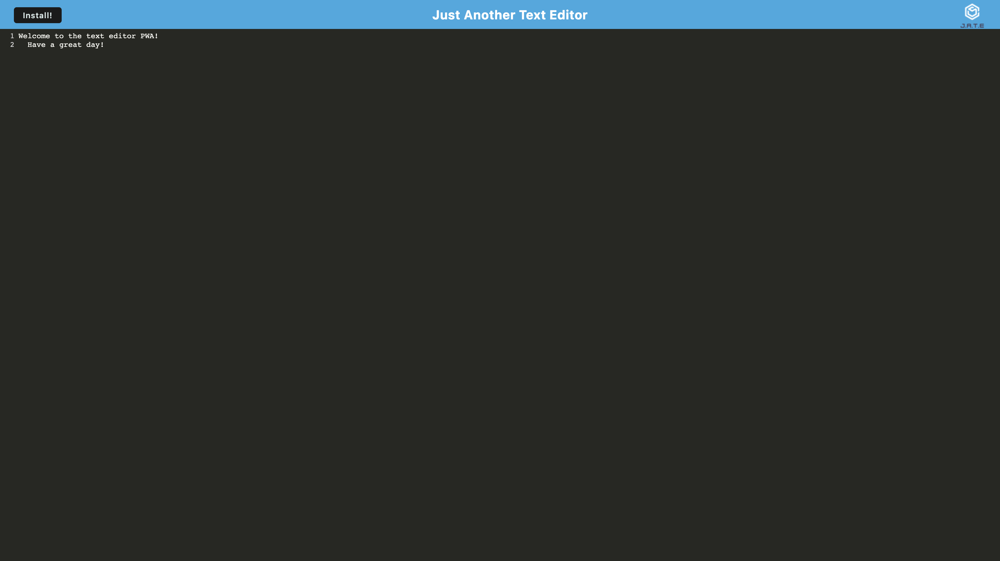

# Text Editor Progressive Web Application
  [](https://opensource.org/licenses/MIT)
  ## Description
  A single page text editor that runs in the browser or offline meeting the qulalifictions of a typical PWA. It allows text to be inputted and saved upon reload.
  ## Table of Contents
  1. [Description](#description)
  2. [Installation](#installation)
  3. [Usage](#usage)
  4. [License](#license)
  5. [Github Repo](#github)
  6. [Deployed Application](#deployed)  
    
    

  ## Installation
  To initialize needed dependencies, run ```npm i```, ```npm run:dev```, and then ```npm start``` to view in localhost:3000 in the browser.
  ## Usage
  This can be used as a model for a simple progessive web application that can work online or offline.
  ## License
  [MIT](https://choosealicense.com/licenses/mit/)
  ## Github Repo
  http://github.com/https://github.com/cartermatschek/text-editor
  ## Deployed Application
  https://arcane-stream-50193.herokuapp.com/
